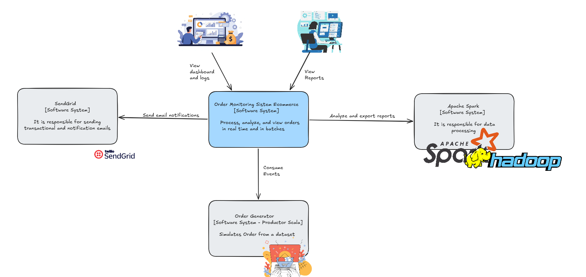
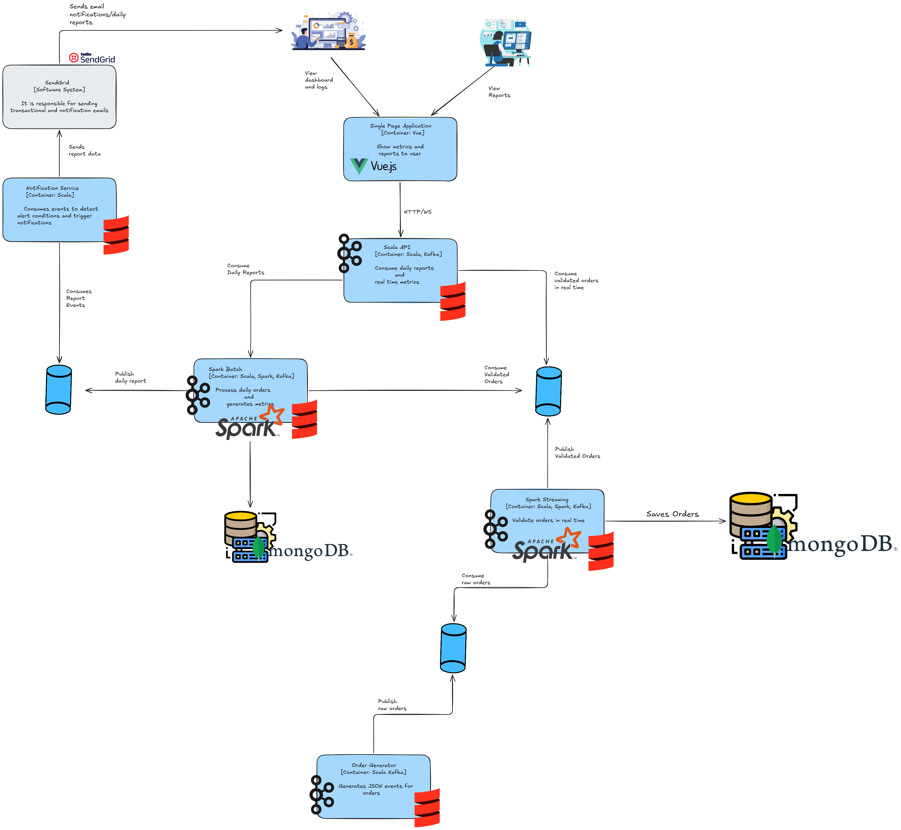

# SCALAPARK

[](https://www.scala-lang.org/)
[](https://kafka.apache.org/)
[](https://spark.apache.org/)
[](https://www.mongodb.com/)
[](https://vuejs.org/)
[](https://docs.docker.com/compose/)

> Event-driven microservices platform for real-time e-commerce order processing and analytics.

SCALAPARK connects a synthetic order generator with a real-time Spark Structured Streaming validation pipeline, a Spark batch analytics engine, a Play Framework REST/WebSocket API, and a Vue 3 dashboard — all wired together through Apache Kafka and orchestrated with Docker Compose.

[Architecture](#architecture) • [Services](#services) • [Getting Started](#getting-started) • [Configuration](#configuration) • [API Reference](#api-reference) • [Development](#development)

---

## Architecture

SCALAPARK follows the [C4 model](https://c4model.com/) to document its architecture at two levels of abstraction.

### Level 1 — Context Diagram

Shows the system as a black box and its relationships with external actors.



The **Operator** monitors real-time order validation through the web dashboard. The **Business Analyst** reviews aggregated KPI reports produced by the batch engine. Neither role interacts directly with Kafka or MongoDB — all access goes through the frontend.

### Level 2 — Container Diagram

Breaks the system down into individually deployable containers and their communication protocols.



Each service runs as an independent Docker container inside the shared `kafka_net` network. ScalaEcommerce publishes orders to Kafka; ScalaStreaming validates them in micro-batches; ScalaBatch aggregates the valid ones into MongoDB and publishes daily reports back to Kafka; ScalaAPI is the single HTTP/WebSocket entry point for the frontend. ScalaNotificationService acts as an alerting sidecar.


---

## Services

| Service | Technology | Port | Responsibility |
|---|---|:---:|---|
| **ScalaEcommerce** | Scala 3.3.4 · Play Framework | `9000` | Synthetic order generator. `POST /order/create` publishes 15 orders to the `orders` topic with a 15-second interval between each one. |
| **ScalaStreaming** | Scala 2.13.16 · Spark Structured Streaming 3.5.1 | — | Consumes `orders`, validates each one, publishes per-order results to `orders-validated` and 30-second window metrics to `orders-validation-metrics`. Also persists to MongoDB. |
| **ScalaBatch** | Scala 2.13.16 · Spark SQL 3.5.1 | — | Accumulates `VALID` orders from `orders-validated` into MongoDB. Every 5 minutes runs a Spark batch job that computes 13 business KPIs and publishes a `DailyReport` to `daily_report` and MongoDB. |
| **ScalaAPI** | Scala 3.3.4 · Play Framework · Pekko | `9100` | REST + Server-Sent Events (SSE) API. Background Kafka consumers feed in-memory state; endpoints serve live metrics and historical reports to the frontend. |
| **ScalaNotificationService** | Scala 2.13.16 · kafka-clients | — | Kafka consumer that fires alerts when the error rate exceeds a threshold, and sends daily report summaries with an Excel attachment via SendGrid (optional). |
| **ScalaParkFrontend** | Vue 3 · TypeScript · Vite · Tailwind CSS | `5173` / `80` | SPA with two dashboards: **Operator** (real-time validation stream and metrics chart) and **Analyst** (batch KPIs, top products, categories, cities). |
| **Kafka** | Confluent Platform 7.5.0 | `29092` | Central event bus. Four topics created automatically by `kafka-init`. |
| **Kafka UI** | provectuslabs/kafka-ui 0.7.0 | `8088` | Web UI for inspecting topics, offsets, and messages. |
| **MongoDB** | mongo:7 | `27017` | Persistent storage for validated orders, validation metrics, batch order accumulation, and generated reports. |

### Kafka Topics

| Topic | Producer | Consumers | Message |
|---|---|---|---|
| `orders` | ScalaEcommerce | ScalaStreaming | Full `Order` object with `header`, `customer`, `location`, `payment`, `items[]` |
| `orders-validated` | ScalaStreaming | ScalaBatch, ScalaAPI | `{ orderId, correlationId, status, errors[], processedAt, order }` |
| `orders-validation-metrics` | ScalaStreaming | ScalaAPI, ScalaNotificationService | `{ windowStart, windowEnd, total, valid, invalid, deserializationErrors }` |
| `daily_report` | ScalaBatch | ScalaAPI, ScalaNotificationService | Full `DailyReport` with all 13 KPIs |

**Internal (container-to-container):** `kafka:9092`  
**External (host machine):** `localhost:29092`

---

## Getting Started

### Prerequisites

For Docker deployment (recommended):
- Docker >= 24
- Docker Compose >= 2.20

For local development (without Docker):
- JDK 17 (Eclipse Temurin recommended)
- sbt 1.12.9
- Node.js >= 20.19 LTS
- A running Kafka broker on `localhost:29092` and MongoDB on `localhost:27017`

### Quick Start

```bash
# 1. Clone the repository
git clone <repo-url> SCALAPARK && cd SCALAPARK

# 2. Configure environment variables
cp .env.example .env
# Edit .env with your values — see the Configuration section

# 3. Start all services
docker compose up -d

# 4. Check that all containers are healthy (~2-3 min on first build)
docker compose ps
```

Once all services are running:

| Interface | URL |
|---|---|
| Frontend dashboard | http://localhost:5173 |
| Kafka UI | http://localhost:8088 |
| ScalaAPI health check | http://localhost:9100/health |
| ScalaEcommerce | http://localhost:9000 |

### Generate Orders

```bash
# Publishes 15 orders (70% valid, 30% invalid) with a 15-second interval between each
curl -X POST http://localhost:9000/order/create
```

The call returns immediately (`202 Accepted`); processing is asynchronous. Validation metrics appear on the Operator dashboard within ~30 seconds. The first batch report is published after the first 5-minute interval.

### Inspect the Pipeline

```bash
# Watch live logs from all services
docker compose logs -f

# Follow a specific service
docker compose logs -f streaming
docker compose logs -f scalabatch

# Consume messages from daily_report
docker compose exec kafka kafka-console-consumer \
  --bootstrap-server kafka:9092 \
  --topic daily_report \
  --from-beginning \
  --max-messages 1

# Query MongoDB
docker compose exec mongo mongosh
```

### Stop the Platform

```bash
docker compose down        # Stop containers, preserve data volumes
docker compose down -v     # Stop containers and delete all data
```

---

## Configuration

### Root `.env`

Loaded by `docker-compose.yml` for ScalaEcommerce, ScalaStreaming, ScalaNotificationService, and ScalaBatch.

| Variable | Required | Description |
|---|:---:|---|
| `KAFKA_BOOTSTRAP_SERVERS` | Yes | Broker address. Use `kafka:9092` inside Compose, `localhost:29092` for local dev. |
| `MONGO_URI` | Yes | MongoDB connection string, e.g. `mongodb://mongo:27017` or an Atlas URI. |
| `DATABASE_NAME` | Yes | MongoDB database name. |
| `COLLECTION_NAME` | Yes | Collection for validated orders (written by ScalaStreaming). |
| `COLLECTION_METRICS` | Yes | Collection for validation window metrics (written by ScalaStreaming). |

### `ScalaBatch/.env`

Additional variables specific to the batch service.

| Variable | Default | Description |
|---|---|---|
| `BATCH_ORDERS_COLLECTION` | — | MongoDB collection for accumulated valid orders (e.g. `batch_orders`). |
| `BATCH_REPORTS_COLLECTION` | — | MongoDB collection for generated reports (e.g. `batch_reports`). |
| `BATCH_INTERVAL_MINUTES` | `5` | How often the Spark batch job runs. |

### Notification Service Variables (optional)

Set in the `environment` block of the `notification` service in `docker-compose.yml`.

| Variable | Default | Description |
|---|---|---|
| `ALERT_ERROR_RATE_PERCENT` | `20.0` | Error rate threshold that triggers an alert. |
| `ALERT_MIN_TOTAL` | `20` | Minimum orders in a window before evaluating the threshold. |
| `ALERT_COOLDOWN_SECONDS` | `600` | Minimum time between consecutive alerts. |
| `NOTIFICATION_EMAIL_ENABLED` | `false` | Enable email delivery via SendGrid. |
| `SENDGRID_API_KEY` | — | SendGrid API key (required when email is enabled). |
| `NOTIFICATION_EMAIL_FROM` | — | Sender address. |
| `NOTIFICATION_EMAIL_TO` | — | Recipient address. |

---

## API Reference

All endpoints are served by **ScalaAPI** on port `9100`.

### Operator Role — Real-time Validation

| Method | Endpoint | Description |
|---|---|---|
| `GET` | `/health` | Service health check. |
| `GET` | `/api/operator/validation/window` | Current validation window metrics (`windowStart`, `windowEnd`, `total`, `valid`, `invalid`, `deserializationErrors`). |
| `GET` | `/api/operator/validation/history?limit=20` | Historical validation windows. `limit` max: 200. |
| `GET` | `/api/operator/validation/stream` | **SSE stream** — emits a new event each time the active window changes. |
| `GET` | `/api/operator/orders/validated?limit=10` | Most recent validated orders (both `VALID` and `INVALID`). `limit` max: 100. |

### Analyst Role — Batch Reports

| Method | Endpoint | Description |
|---|---|---|
| `GET` | `/api/analyst/daily` | Summary statistics from the latest batch report (`totalRevenue`, `avgOrderValue`, `totalOrders`). |
| `GET` | `/api/analyst/revenue/trend?days=30` | Revenue trend over the last N days. Range: 7–365. |
| `GET` | `/api/analyst/report/latest` | Full latest batch report with all 13 KPIs. |
| `GET` | `/api/analyst/daily/stream` | **SSE stream** — emits a new event each time a batch report is published. |

> [!NOTE]
> SSE endpoints return `Content-Type: text/event-stream`. Use the browser [`EventSource` API](https://developer.mozilla.org/en-US/docs/Web/API/EventSource) or an equivalent client. Each event body is a JSON string: `data: {...}\n\n`.

### Batch Report KPIs

Each `DailyReport` document produced by ScalaBatch contains 13 business indicators:

| # | KPI | Field |
|:---:|---|---|
| 1 | Total valid orders processed | `totalOrders` |
| 2 | Total revenue | `totalRevenue` |
| 3 | Average revenue per order | `averageRevenuePerOrder` |
| 4 | Average items per order | `averageItemsPerOrder` |
| 5 | Average ticket size | `averageTicketSize` |
| 6 | Credit purchase ratio (installments > 1) | `creditPurchaseRatio` |
| 7 | Top 5 products by quantity sold | `topProducts[]` |
| 8 | Top 5 categories by revenue | `topCategoriesByRevenue[]` |
| 9 | Top 5 cities by order count | `topCitiesByOrders[]` |
| 10 | Top 3 departments by revenue | `topDepartmentsByRevenue[]` |
| 11 | Hourly order distribution | `hourlyDistribution[]` |
| 12 | Document type distribution | `docTypeDistribution[]` |
| 13 | Installments distribution | `installmentsDistribution[]` |


---

## Development

### Running Individual Services Locally

Start only the infrastructure containers, then run the Scala service of your choice with `sbt`:

```bash
# Start Kafka, MongoDB, and tooling only
docker compose up -d zookeeper kafka kafka-init mongo kafka-ui

# Run a Play Framework service (Scala 3)
cd ScalaEcommerce   # or ScalaAPI
sbt run             # available at localhost:9000 / localhost:9100

# Run a Spark service (Scala 2.13)
cd ScalaStreaming    # or ScalaBatch
sbt run
```

> [!IMPORTANT]
> Spark 3.5 requires four JVM flags for JDK 17 compatibility. These are pre-configured in each service's `build.sbt` (`javaOptions`) and in the Dockerfiles, so `sbt run` picks them up automatically:
> ```
> --add-exports=java.base/sun.nio.ch=ALL-UNNAMED
> --add-opens=java.base/sun.nio.ch=ALL-UNNAMED
> --add-exports=java.base/sun.security.action=ALL-UNNAMED
> --add-opens=java.base/sun.security.action=ALL-UNNAMED
> ```

### Frontend Development

```bash
cd ScalaParkFrontend
npm install
npm run dev        # Vite dev server at http://localhost:5173 with HMR
```

The Vite dev server proxies all `/api/*` requests to `http://localhost:9100`, so ScalaAPI must be running locally or via Docker.

### Useful sbt Commands

```bash
sbt compile        # Compile the project
sbt run            # Run locally
sbt test           # Run tests (Play services)
sbt assembly       # Build a fat JAR (Spark services)
sbt stage          # Build a Play distribution (Play services)
sbt clean          # Remove build artifacts
```

---

## Troubleshooting

**Containers fail to start / healthcheck loops**

Kafka and MongoDB have healthchecks configured; other services use `depends_on: condition: service_healthy`. If a service keeps restarting, check the Kafka and Zookeeper logs first:

```bash
docker compose logs kafka zookeeper
```

**Operator dashboard shows no data**

ScalaStreaming must be running and orders must be flowing through the `orders` topic. Generate a batch with `curl -X POST http://localhost:9000/order/create` and wait ~30 seconds for the first validation window.

**Analyst dashboard always shows zeros**

The first batch report is published only after `BATCH_INTERVAL_MINUTES` (default: 5 min) **and** at least one `VALID` order exists in `batch_orders`. The log line `Skipping report publication — no orders yet` is normal until data accumulates.

**Port conflicts**

```bash
# Find which process owns a port
sudo lsof -i :9092

# Or change the host-side port mapping in docker-compose.yml under `ports:`
```

**`Unable to deserialize message` in ScalaBatch logs**

A message in `orders-validated` doesn't match the `ValidatedOrderEnvelope` schema. The consumer discards it, commits the offset, and continues — this is intentional behavior.

**Spark errors about `sun.nio.ch` when running with `sbt run`**

The four `--add-exports`/`--add-opens` flags are not being applied. Verify the `Compile / run / javaOptions` block in the relevant `build.sbt`.

**Scala version mismatch errors**

ScalaStreaming and ScalaBatch use **Scala 2.13.16** (Spark 3.5 does not yet support Scala 3). ScalaEcommerce and ScalaAPI use **Scala 3.3.4**. Never mix these projects in a single sbt build without proper cross-compilation configuration.

**ScalaNotificationService sends no emails**

Email delivery is disabled by default (`NOTIFICATION_EMAIL_ENABLED=false`). To enable it, set `NOTIFICATION_EMAIL_ENABLED=true` and provide `SENDGRID_API_KEY`, `NOTIFICATION_EMAIL_FROM`, and `NOTIFICATION_EMAIL_TO` in the `notification` service environment.
